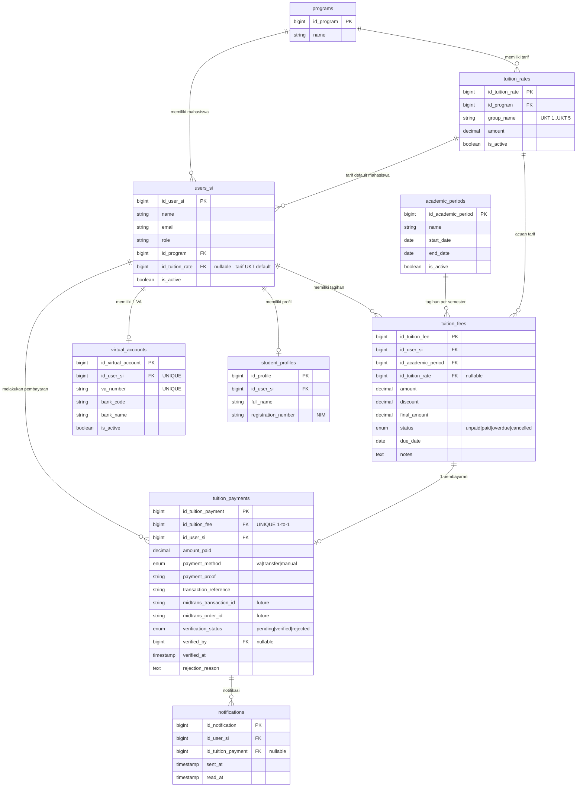
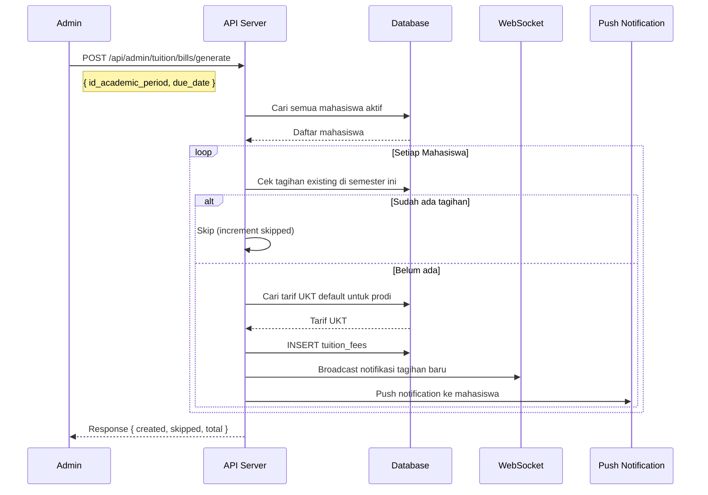
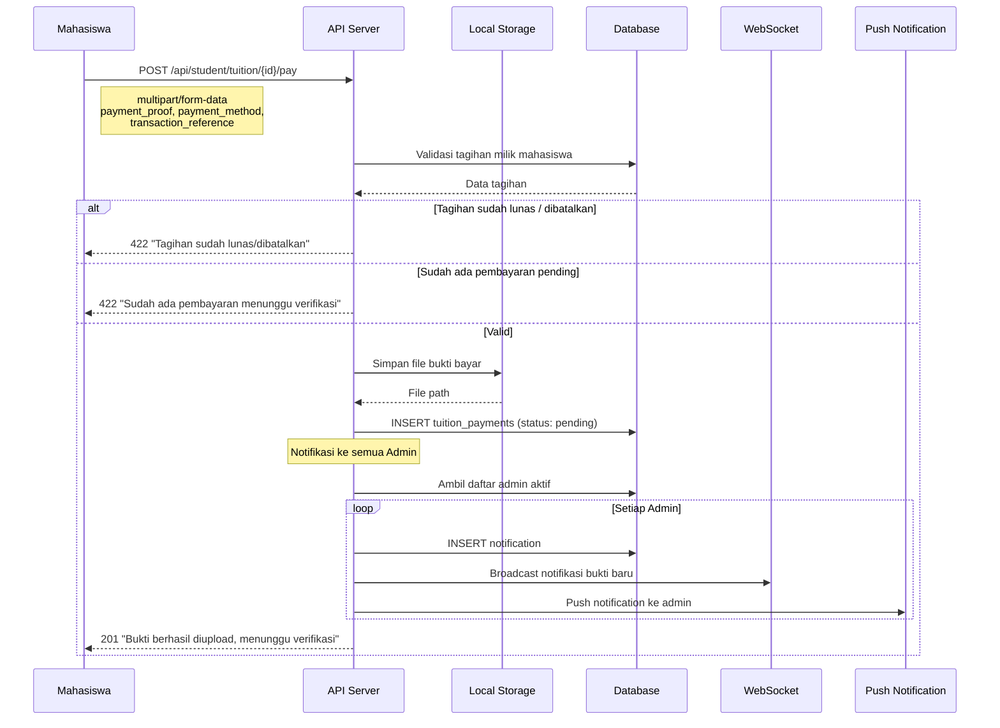
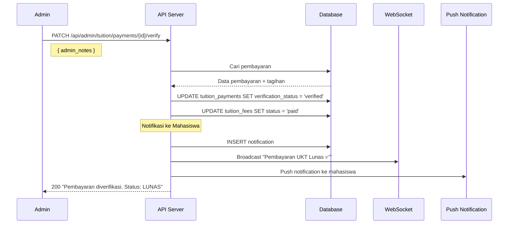
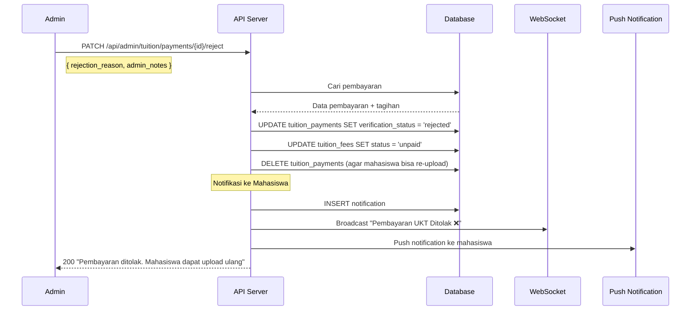

# Dokumentasi API Pembayaran UKT/SPP - SIA UGN

## Daftar Isi

- [Informasi Umum](#informasi-umum)
- [Autentikasi](#autentikasi)
- [Entitas Database](#entitas-database)
  - [Tabel Baru](#tabel-baru)
  - [Tabel Terkait (Existing)](#tabel-terkait-existing)
  - [ERD (Entity Relationship Diagram)](#erd-entity-relationship-diagram)
- [Sequence Diagram](#sequence-diagram)
  - [SD1. Generate Tagihan Massal](#sd1-generate-tagihan-massal)
  - [SD2. Upload Bukti Pembayaran](#sd2-upload-bukti-pembayaran)
  - [SD3. Verifikasi Pembayaran](#sd3-verifikasi-pembayaran)
  - [SD4. Tolak Pembayaran](#sd4-tolak-pembayaran)
- [A. Endpoint Mahasiswa](#a-endpoint-mahasiswa)
  - [A1. Tagihan UKT](#a1-tagihan-ukt)
  - [A2. Virtual Account](#a2-virtual-account)
  - [A3. Pembayaran](#a3-pembayaran)
- [B. Endpoint Admin & Manager](#b-endpoint-admin--manager)
  - [B1. Dashboard](#b1-dashboard)
  - [B2. Tarif UKT Berjenjang](#b2-tarif-ukt-berjenjang)
  - [B3. Manajemen Tagihan](#b3-manajemen-tagihan)
  - [B4. Verifikasi Pembayaran](#b4-verifikasi-pembayaran)
  - [B5. Virtual Account](#b5-virtual-account)
- [C. Notifikasi](#c-notifikasi)
- [D. Status & Alur](#d-status--alur)
- [E. Daftar Endpoint Ringkasan](#e-daftar-endpoint-ringkasan)

---

## Informasi Umum

| Item | Detail |
|------|--------|
| Base URL | `/api` |
| Format Response | JSON |
| Autentikasi | Bearer Token (Sanctum) |
| Content-Type | `application/json` (kecuali upload: `multipart/form-data`) |

### Format Response Standar

```json
{
    "status": "success | error",
    "message": "Pesan deskriptif",
    "data": "... | []"
}
```

### HTTP Status Codes

| Code | Deskripsi |
|------|-----------|
| 200 | OK - Request berhasil |
| 201 | Created - Data berhasil dibuat |
| 403 | Forbidden - Tidak memiliki akses |
| 404 | Not Found - Data tidak ditemukan |
| 422 | Unprocessable Entity - Validasi gagal / Business logic error |
| 500 | Internal Server Error - Error internal |

---

## Autentikasi

Semua endpoint membutuhkan autentikasi via Sanctum. Sertakan header:

```
Authorization: Bearer {token}
```

---

## Entitas Database

### Tabel Baru

#### 1. `tuition_rates` — Tarif UKT Berjenjang

Menyimpan tarif UKT berjenjang (UKT 1 sampai UKT 8) per program studi.

| Kolom | Tipe | Nullable | Deskripsi |
|-------|------|----------|-----------|
| `id_tuition_rate` | BIGINT (PK) | No | Primary key |
| `id_program` | BIGINT (FK) | No | FK ke `programs.id_program` |
| `group_name` | VARCHAR(50) | No | Nama group UKT (contoh: "UKT 1", "UKT 2", ..., "UKT 8") |
| `amount` | DECIMAL(15,2) | No | Nominal UKT dalam Rupiah |
| `is_active` | BOOLEAN | No | Status aktif tarif (default: true) |
| `created_at` | TIMESTAMP | Yes | Waktu dibuat |
| `updated_at` | TIMESTAMP | Yes | Waktu terakhir diubah |

**Constraints:**
- `UNIQUE(id_program, group_name)` — Satu prodi hanya boleh punya 1 group_name unik.
- `INDEX(is_active)` — Optimasi query tarif aktif.

---

#### 2. `virtual_accounts` — Virtual Account Mahasiswa

Menyimpan nomor Virtual Account unik per mahasiswa. Format: prefix bank (4 digit) + NIM.

| Kolom | Tipe | Nullable | Deskripsi |
|-------|------|----------|-----------|
| `id_virtual_account` | BIGINT (PK) | No | Primary key |
| `id_user_si` | BIGINT (FK) | No | FK ke `users_si.id_user_si` (UNIQUE, 1:1) |
| `va_number` | VARCHAR(30) | No | Nomor VA unik (contoh: "88012024001") |
| `bank_code` | VARCHAR(10) | No | Kode bank (contoh: "BNI", "BRI") |
| `bank_name` | VARCHAR(100) | No | Nama lengkap bank |
| `is_active` | BOOLEAN | No | Status aktif VA (default: true) |
| `created_at` | TIMESTAMP | Yes | Waktu dibuat |
| `updated_at` | TIMESTAMP | Yes | Waktu terakhir diubah |

**Constraints:**
- `UNIQUE(id_user_si)` — Satu mahasiswa hanya 1 VA.
- `UNIQUE(va_number)` — Nomor VA harus unik.

---

#### 3. `tuition_fees` — Tagihan UKT per Semester

Menyimpan tagihan UKT per mahasiswa per periode akademik (semester).

| Kolom | Tipe | Nullable | Deskripsi |
|-------|------|----------|-----------|
| `id_tuition_fee` | BIGINT (PK) | No | Primary key |
| `id_user_si` | BIGINT (FK) | No | FK ke `users_si.id_user_si` |
| `id_academic_period` | BIGINT (FK) | No | FK ke `academic_periods.id_academic_period` |
| `id_tuition_rate` | BIGINT (FK) | Yes | FK ke `tuition_rates.id_tuition_rate` (acuan tarif) |
| `amount` | DECIMAL(15,2) | No | Nominal UKT bruto |
| `discount` | DECIMAL(15,2) | No | Potongan beasiswa/diskon (default: 0) |
| `final_amount` | DECIMAL(15,2) | No | `amount - discount` = yang harus dibayar |
| `status` | ENUM | No | `unpaid`, `paid`, `overdue`, `cancelled` (default: `unpaid`) |
| `due_date` | DATE | Yes | Tanggal jatuh tempo |
| `notes` | TEXT | Yes | Catatan admin |
| `created_at` | TIMESTAMP | Yes | Waktu dibuat |
| `updated_at` | TIMESTAMP | Yes | Waktu terakhir diubah |

**Constraints:**
- `UNIQUE(id_user_si, id_academic_period)` — 1 mahasiswa hanya 1 tagihan per semester.
- `INDEX(status)` — Optimasi query filtering status.
- `INDEX(due_date)` — Optimasi query jatuh tempo.

---

#### 4. `tuition_payments` — Pembayaran UKT

Menyimpan data pembayaran UKT. Relasi 1:1 dengan `tuition_fees` (tanpa cicilan).

| Kolom | Tipe | Nullable | Deskripsi |
|-------|------|----------|-----------|
| `id_tuition_payment` | BIGINT (PK) | No | Primary key |
| `id_tuition_fee` | BIGINT (FK) | No | FK ke `tuition_fees.id_tuition_fee` (UNIQUE, 1:1) |
| `id_user_si` | BIGINT (FK) | No | FK ke `users_si.id_user_si` (mahasiswa yang membayar) |
| `amount_paid` | DECIMAL(15,2) | No | Nominal yang dibayarkan |
| `payment_method` | ENUM | No | `virtual_account`, `bank_transfer`, `manual` (default: `bank_transfer`) |
| `payment_proof` | VARCHAR(255) | Yes | Path ke file bukti bayar di local storage |
| `transaction_reference` | VARCHAR(100) | Yes | Nomor referensi dari bank |
| `midtrans_transaction_id` | VARCHAR(100) | Yes | Transaction ID dari Midtrans (future) |
| `midtrans_order_id` | VARCHAR(100) | Yes | Order ID untuk Midtrans (future) |
| `midtrans_payment_type` | VARCHAR(50) | Yes | Tipe pembayaran Midtrans (future) |
| `midtrans_response` | JSON | Yes | Raw JSON response dari Midtrans (future) |
| `verification_status` | ENUM | No | `pending`, `verified`, `rejected` (default: `pending`) |
| `verified_by` | BIGINT (FK) | Yes | FK ke `users_si.id_user_si` (admin yang memverifikasi) |
| `verified_at` | TIMESTAMP | Yes | Waktu verifikasi |
| `rejection_reason` | TEXT | Yes | Alasan penolakan |
| `admin_notes` | TEXT | Yes | Catatan admin |
| `created_at` | TIMESTAMP | Yes | Waktu dibuat |
| `updated_at` | TIMESTAMP | Yes | Waktu terakhir diubah |

**Constraints:**
- `UNIQUE(id_tuition_fee)` — 1 tagihan hanya 1 pembayaran (tanpa cicilan).
- `INDEX(verification_status)`, `INDEX(payment_method)` — Optimasi query.
- `INDEX(midtrans_transaction_id)`, `INDEX(midtrans_order_id)` — Optimasi future Midtrans lookup.

> **Catatan:** Kolom `midtrans_*` sudah disiapkan untuk integrasi payment gateway Midtrans di masa depan. Untuk MVP, kolom-kolom ini akan tetap NULL.

---

#### 5. Modifikasi `notifications` — FK Tambahan

| Kolom Baru | Tipe | Nullable | Deskripsi |
|------------|------|----------|-----------|
| `id_tuition_payment` | BIGINT (FK) | Yes | FK ke `tuition_payments.id_tuition_payment` |

---

### Tabel Terkait (Existing)

| Tabel | Relasi | Deskripsi |
|-------|--------|-----------|
| `users_si` | N:1 → `tuition_rates` | Setiap mahasiswa memiliki tarif UKT default |
| `users_si` | 1:N → `tuition_fees` | Satu mahasiswa memiliki banyak tagihan (per semester) |
| `users_si` | 1:N → `tuition_payments` | Satu mahasiswa memiliki banyak pembayaran |
| `users_si` | 1:1 → `virtual_accounts` | Satu mahasiswa memiliki satu VA |
| `academic_periods` | 1:N → `tuition_fees` | Satu semester memiliki banyak tagihan |
| `programs` | 1:N → `tuition_rates` | Satu prodi memiliki banyak tarif UKT berjenjang |
| `student_profiles` | — (via `users_si`) | Data NIM dan nama lengkap mahasiswa |
| `notifications` | N:1 → `tuition_payments` | Notifikasi referensi ke pembayaran UKT |

---

### ERD (Entity Relationship Diagram)



---

## Sequence Diagram

### SD1. Generate Tagihan Massal



---

### SD2. Upload Bukti Pembayaran



---

### SD3. Verifikasi Pembayaran



---

### SD4. Tolak Pembayaran



---

## A. Endpoint Mahasiswa

Endpoint ini hanya dapat diakses oleh user dengan role `mahasiswa`.

---

### A1. Tagihan UKT

#### `GET /api/student/tuition` — Daftar Tagihan UKT

Mengambil semua tagihan UKT milik mahasiswa yang sedang login, beserta ringkasan statistik.

**Query Parameters:**

| Parameter | Tipe | Required | Deskripsi |
|-----------|------|----------|-----------|
| `status` | string | No | Filter: `unpaid`, `paid`, `overdue`, `cancelled` |
| `academic_period_id` | integer | No | Filter berdasarkan ID periode akademik |

**Response 200:**

```json
{
    "status": "success",
    "message": "Daftar tagihan UKT berhasil diambil.",
    "data": {
        "bills": [
            {
                "id_tuition_fee": 1,
                "academic_period": {
                    "id_academic_period": 3,
                    "name": "Semester Genap 2025/2026",
                    "is_active": true
                },
                "tuition_rate": {
                    "group_name": "UKT 5",
                    "base_amount": 4000000.00
                },
                "amount": 4000000.00,
                "discount": 500000.00,
                "final_amount": 3500000.00,
                "status": "unpaid",
                "due_date": "2026-05-30",
                "is_overdue": false,
                "notes": "Mendapat potongan beasiswa",
                "payment": null,
                "created_at": "2026-04-17T00:00:00.000000Z"
            },
            {
                "id_tuition_fee": 2,
                "academic_period": {
                    "id_academic_period": 2,
                    "name": "Semester Ganjil 2025/2026",
                    "is_active": false
                },
                "tuition_rate": {
                    "group_name": "UKT 5",
                    "base_amount": 4000000.00
                },
                "amount": 4000000.00,
                "discount": 0.00,
                "final_amount": 4000000.00,
                "status": "paid",
                "due_date": "2025-11-30",
                "is_overdue": false,
                "notes": null,
                "payment": {
                    "id_tuition_payment": 1,
                    "amount_paid": 4000000.00,
                    "payment_method": "virtual_account",
                    "verification_status": "verified",
                    "verified_at": "2025-10-15T10:30:00.000000Z",
                    "uploaded_at": "2025-10-14T08:00:00.000000Z"
                },
                "created_at": "2025-09-01T00:00:00.000000Z"
            }
        ],
        "summary": {
            "total_bills": 2,
            "total_unpaid": 1,
            "total_paid": 1,
            "total_overdue": 0,
            "total_unpaid_amount": 3500000.00
        }
    }
}
```

---

#### `GET /api/student/tuition/{id}` — Detail Tagihan

**Response 200:**

```json
{
    "status": "success",
    "message": "Detail tagihan UKT berhasil diambil.",
    "data": {
        "id_tuition_fee": 1,
        "academic_period": {
            "id_academic_period": 3,
            "name": "Semester Genap 2025/2026",
            "start_date": "2026-02-01",
            "end_date": "2026-07-31",
            "is_active": true
        },
        "tuition_rate": {
            "id_tuition_rate": 5,
            "group_name": "UKT 5",
            "base_amount": 4000000.00
        },
        "amount": 4000000.00,
        "discount": 500000.00,
        "final_amount": 3500000.00,
        "status": "unpaid",
        "due_date": "2026-05-30",
        "is_overdue": false,
        "notes": "Mendapat potongan beasiswa",
        "payment": null,
        "created_at": "2026-04-17T00:00:00.000000Z",
        "updated_at": "2026-04-17T00:00:00.000000Z"
    }
}
```

**Response 200 (dengan pembayaran yang sudah diverifikasi):**

```json
{
    "status": "success",
    "message": "Detail tagihan UKT berhasil diambil.",
    "data": {
        "id_tuition_fee": 2,
        "...": "...",
        "status": "paid",
        "payment": {
            "id_tuition_payment": 1,
            "amount_paid": 4000000.00,
            "payment_method": "virtual_account",
            "payment_proof": "http://localhost:8000/storage/payment-proofs/payment_5_2_1713300000.jpg",
            "transaction_reference": "TRX000001",
            "verification_status": "verified",
            "verified_by": "Admin UGN",
            "verified_at": "2025-10-15T10:30:00.000000Z",
            "rejection_reason": null,
            "uploaded_at": "2025-10-14T08:00:00.000000Z"
        }
    }
}
```

---

### A2. Virtual Account

#### `GET /api/student/tuition/virtual-account` — Info Virtual Account

Mengambil informasi Virtual Account mahasiswa yang sedang login.

**Response 200:**

```json
{
    "status": "success",
    "message": "Informasi Virtual Account berhasil diambil.",
    "data": {
        "va_number": "88012024001",
        "bank_code": "BNI",
        "bank_name": "Bank Negara Indonesia",
        "is_active": true
    }
}
```

**Response 404 (VA belum tersedia):**

```json
{
    "status": "error",
    "message": "Virtual Account belum tersedia. Silakan hubungi admin.",
    "data": null
}
```

---

### A3. Pembayaran

#### `POST /api/student/tuition/{id}/pay` — Upload Bukti Pembayaran

Upload bukti pembayaran UKT untuk tagihan tertentu. Menggunakan `multipart/form-data`.

**Request Body (multipart/form-data):**

| Field | Tipe | Required | Validasi | Deskripsi |
|-------|------|----------|----------|-----------|
| `payment_proof` | file | Yes | jpg, jpeg, png, pdf / max 5MB | File bukti pembayaran |
| `payment_method` | string | Yes | `virtual_account`, `bank_transfer`, `manual` | Metode pembayaran |
| `transaction_reference` | string | No | max 100 karakter | Nomor referensi dari bank |
| `amount_paid` | numeric | No | min 0 | Nominal yang dibayarkan (default: final_amount tagihan) |

**Response 201:**

```json
{
    "status": "success",
    "message": "Bukti pembayaran berhasil diupload. Menunggu verifikasi admin.",
    "data": {
        "id_tuition_payment": 4,
        "id_tuition_fee": 1,
        "amount_paid": 3500000.00,
        "payment_method": "bank_transfer",
        "payment_proof_url": "http://localhost:8000/storage/payment-proofs/payment_5_1_1713300000.jpg",
        "verification_status": "pending",
        "uploaded_at": "2026-04-17T08:00:00.000000Z"
    }
}
```

**Response 422 (Tagihan sudah lunas):**

```json
{
    "status": "error",
    "message": "Tagihan ini sudah lunas."
}
```

**Response 422 (Sudah ada pembayaran pending):**

```json
{
    "status": "error",
    "message": "Sudah ada pembayaran yang menunggu verifikasi untuk tagihan ini.",
    "data": {
        "id_tuition_payment": 3,
        "verification_status": "pending",
        "uploaded_at": "2026-04-16T10:00:00.000000Z"
    }
}
```

**Response 422 (Tagihan dibatalkan):**

```json
{
    "status": "error",
    "message": "Tagihan ini sudah dibatalkan."
}
```

---

#### `GET /api/student/tuition/payments` — Riwayat Pembayaran

**Response 200:**

```json
{
    "status": "success",
    "message": "Riwayat pembayaran berhasil diambil.",
    "data": [
        {
            "id_tuition_payment": 1,
            "academic_period": "Semester Ganjil 2025/2026",
            "amount_paid": 4000000.00,
            "payment_method": "virtual_account",
            "payment_proof_url": "http://localhost:8000/storage/payment-proofs/payment_5_2_1713300000.jpg",
            "transaction_reference": "TRX000001",
            "verification_status": "verified",
            "verified_by": "Admin UGN",
            "verified_at": "2025-10-15T10:30:00.000000Z",
            "rejection_reason": null,
            "uploaded_at": "2025-10-14T08:00:00.000000Z"
        }
    ]
}
```

---

#### `GET /api/student/tuition/payments/{id}` — Detail Pembayaran

**Response 200:**

```json
{
    "status": "success",
    "message": "Detail pembayaran berhasil diambil.",
    "data": {
        "id_tuition_payment": 1,
        "tuition_fee": {
            "id_tuition_fee": 2,
            "academic_period": "Semester Ganjil 2025/2026",
            "final_amount": 4000000.00,
            "status": "paid"
        },
        "amount_paid": 4000000.00,
        "payment_method": "virtual_account",
        "payment_proof_url": "http://localhost:8000/storage/payment-proofs/payment_5_2_1713300000.jpg",
        "transaction_reference": "TRX000001",
        "verification_status": "verified",
        "verified_by": "Admin UGN",
        "verified_at": "2025-10-15T10:30:00.000000Z",
        "rejection_reason": null,
        "admin_notes": "Pembayaran sesuai nominal.",
        "uploaded_at": "2025-10-14T08:00:00.000000Z"
    }
}
```

---

## B. Endpoint Admin & Manager

Endpoint ini hanya dapat diakses oleh user dengan role `admin` atau `manager`.

---

### B1. Dashboard

#### `GET /api/admin/tuition/dashboard` — Dashboard Statistik

Menampilkan ringkasan pembayaran UKT, termasuk breakdown per program studi.

**Query Parameters:**

| Parameter | Tipe | Required | Deskripsi |
|-----------|------|----------|-----------|
| `academic_period_id` | integer | No | Filter berdasarkan semester (default: semester aktif) |

**Response 200:**

```json
{
    "status": "success",
    "message": "Dashboard statistik UKT berhasil diambil.",
    "data": {
        "period_id": 3,
        "summary": {
            "total_bills": 150,
            "total_unpaid": 85,
            "total_paid": 55,
            "total_overdue": 10,
            "total_cancelled": 0,
            "total_amount": 600000000.00,
            "total_paid_amount": 220000000.00,
            "total_unpaid_amount": 380000000.00,
            "pending_verification": 5
        },
        "by_program": [
            {
                "id_program": 1,
                "program_name": "Teknologi Rekayasa Perangkat Lunak",
                "total": 50,
                "paid": 20,
                "unpaid": 30,
                "total_amount": 200000000.00,
                "paid_amount": 80000000.00
            },
            {
                "id_program": 2,
                "program_name": "Teknik Informatika",
                "total": 60,
                "paid": 25,
                "unpaid": 35,
                "total_amount": 240000000.00,
                "paid_amount": 100000000.00
            }
        ]
    }
}
```

---

### B2. Tarif UKT Berjenjang

#### `GET /api/admin/tuition/rates` — Daftar Tarif UKT

**Query Parameters:**

| Parameter | Tipe | Required | Deskripsi |
|-----------|------|----------|-----------|
| `program_id` | integer | No | Filter berdasarkan program studi |

**Response 200:**

```json
{
    "status": "success",
    "message": "Daftar tarif UKT berhasil diambil.",
    "data": [
        {
            "id_tuition_rate": 1,
            "program": {
                "id_program": 1,
                "name": "Teknologi Rekayasa Perangkat Lunak"
            },
            "group_name": "UKT 1",
            "amount": 500000.00,
            "is_active": true,
            "created_at": "2026-04-17T00:00:00.000000Z"
        },
        {
            "id_tuition_rate": 2,
            "program": {
                "id_program": 1,
                "name": "Teknologi Rekayasa Perangkat Lunak"
            },
            "group_name": "UKT 2",
            "amount": 1000000.00,
            "is_active": true,
            "created_at": "2026-04-17T00:00:00.000000Z"
        }
    ]
}
```

---

#### `POST /api/admin/tuition/rates` — Buat Tarif UKT

**Request Body:**

```json
{
    "id_program": 1,
    "group_name": "UKT 1",
    "amount": 500000,
    "is_active": true
}
```

| Field | Tipe | Required | Deskripsi |
|-------|------|----------|-----------|
| `id_program` | integer | Yes | ID program studi (FK) |
| `group_name` | string | Yes | Nama group UKT, max 50 char (contoh: "UKT 1") |
| `amount` | numeric | Yes | Nominal UKT dalam Rupiah (min 0) |
| `is_active` | boolean | No | Status aktif (default: true) |

**Response 201:**

```json
{
    "status": "success",
    "message": "Tarif UKT berhasil dibuat.",
    "data": {
        "id_tuition_rate": 1,
        "group_name": "UKT 1",
        "amount": 500000.00
    }
}
```

**Response 422 (Duplikat):**

```json
{
    "status": "error",
    "message": "Tarif UKT 'UKT 1' untuk program studi ini sudah ada."
}
```

---

#### `PUT /api/admin/tuition/rates/{id}` — Update Tarif UKT

**Request Body:** Semua field optional (partial update).

```json
{
    "amount": 750000,
    "is_active": false
}
```

| Field | Tipe | Required | Deskripsi |
|-------|------|----------|-----------|
| `group_name` | string | No | Nama group UKT |
| `amount` | numeric | No | Nominal UKT baru |
| `is_active` | boolean | No | Status aktif |

**Response 200:**

```json
{
    "status": "success",
    "message": "Tarif UKT berhasil diperbarui.",
    "data": {
        "id_tuition_rate": 1,
        "group_name": "UKT 1",
        "amount": 750000.00,
        "is_active": false
    }
}
```

---

#### `DELETE /api/admin/tuition/rates/{id}` — Hapus Tarif UKT

**Response 200:**

```json
{
    "status": "success",
    "message": "Tarif UKT berhasil dihapus."
}
```

**Response 422 (Sudah digunakan di tagihan):**

```json
{
    "status": "error",
    "message": "Tarif UKT tidak dapat dihapus karena sudah digunakan di tagihan. Nonaktifkan saja."
}
```

---

### B3. Manajemen Tagihan

#### `GET /api/admin/tuition/bills` — Daftar Tagihan

**Query Parameters:**

| Parameter | Tipe | Required | Deskripsi |
|-----------|------|----------|-----------|
| `academic_period_id` | integer | No | Filter berdasarkan semester |
| `status` | string | No | Filter: `unpaid`, `paid`, `overdue`, `cancelled` |
| `program_id` | integer | No | Filter berdasarkan program studi |
| `search` | string | No | Cari berdasarkan nama atau NIM mahasiswa |

**Response 200:**

```json
{
    "status": "success",
    "message": "Daftar tagihan UKT berhasil diambil.",
    "data": [
        {
            "id_tuition_fee": 1,
            "student": {
                "id_user_si": 5,
                "name": "Budi Santoso",
                "nim": "2024001",
                "program": "Teknik Informatika"
            },
            "academic_period": "Semester Genap 2025/2026",
            "group_name": "UKT 5",
            "amount": 4000000.00,
            "discount": 500000.00,
            "final_amount": 3500000.00,
            "status": "unpaid",
            "due_date": "2026-05-30",
            "payment_status": null,
            "created_at": "2026-04-17T00:00:00.000000Z"
        }
    ]
}
```

---

#### `GET /api/admin/tuition/bills/{id}` — Detail Tagihan

**Response 200:**

```json
{
    "status": "success",
    "message": "Detail tagihan UKT berhasil diambil.",
    "data": {
        "id_tuition_fee": 1,
        "student": {
            "id_user_si": 5,
            "name": "Budi Santoso",
            "nim": "2024001",
            "program": "Teknik Informatika"
        },
        "virtual_account": {
            "va_number": "88012024001",
            "bank_name": "Bank Negara Indonesia"
        },
        "academic_period": {
            "id_academic_period": 3,
            "name": "Semester Genap 2025/2026"
        },
        "tuition_rate": {
            "id_tuition_rate": 5,
            "group_name": "UKT 5",
            "base_amount": 4000000.00
        },
        "amount": 4000000.00,
        "discount": 500000.00,
        "final_amount": 3500000.00,
        "status": "unpaid",
        "due_date": "2026-05-30",
        "notes": "Mendapat potongan beasiswa",
        "payment": null,
        "created_at": "2026-04-17T00:00:00.000000Z",
        "updated_at": "2026-04-17T00:00:00.000000Z"
    }
}
```

---

#### `POST /api/admin/tuition/bills` — Buat Tagihan Individu

Membuat tagihan UKT untuk 1 mahasiswa pada 1 semester.

**Request Body:**

```json
{
    "id_user_si": 5,
    "id_academic_period": 3,
    "id_tuition_rate": 5,
    "amount": 4000000,
    "discount": 500000,
    "due_date": "2026-05-30",
    "notes": "Mendapat potongan beasiswa"
}
```

| Field | Tipe | Required | Deskripsi |
|-------|------|----------|-----------|
| `id_user_si` | integer | Yes | ID mahasiswa |
| `id_academic_period` | integer | Yes | ID periode akademik |
| `id_tuition_rate` | integer | No | ID tarif UKT acuan |
| `amount` | numeric | Yes | Nominal UKT bruto (min 0) |
| `discount` | numeric | No | Diskon/beasiswa (min 0, default: 0) |
| `due_date` | date | No | Tanggal jatuh tempo |
| `notes` | string | No | Catatan admin (max 1000) |

> **Catatan:** `final_amount` otomatis dihitung: `amount - discount`.

**Response 201:**

```json
{
    "status": "success",
    "message": "Tagihan UKT berhasil dibuat.",
    "data": {
        "id_tuition_fee": 16,
        "final_amount": 3500000.00,
        "status": "unpaid"
    }
}
```

**Response 422 (Duplikat):**

```json
{
    "status": "error",
    "message": "Mahasiswa ini sudah memiliki tagihan pada semester tersebut."
}
```

---

#### `POST /api/admin/tuition/bills/generate` — Generate Tagihan Massal

Generate tagihan UKT untuk **seluruh mahasiswa aktif** pada semester tertentu. Mahasiswa yang sudah punya tagihan di semester tersebut akan di-skip.

**Request Body:**

```json
{
    "id_academic_period": 3,
    "due_date": "2026-05-30",
    "notes": "Tagihan semester genap 2025/2026"
}
```

| Field | Tipe | Required | Deskripsi |
|-------|------|----------|-----------|
| `id_academic_period` | integer | Yes | ID periode akademik |
| `due_date` | date | No | Tanggal jatuh tempo untuk semua tagihan |
| `notes` | string | No | Catatan untuk semua tagihan (max 1000) |

**Response 201:**

```json
{
    "status": "success",
    "message": "Tagihan massal berhasil digenerate. 120 tagihan dibuat, 30 dilewati.",
    "data": {
        "created": 120,
        "skipped": 30,
        "total_students": 150,
        "errors": []
    }
}
```

---

#### `PUT /api/admin/tuition/bills/{id}` — Update Tagihan

Update nominal, diskon, jatuh tempo, atau status tagihan. Tagihan yang sudah lunas tidak dapat diubah.

**Request Body:** Semua field optional (partial update).

```json
{
    "amount": 4500000,
    "discount": 1000000,
    "due_date": "2026-06-15",
    "notes": "Nominal diubah sesuai kebijakan baru"
}
```

| Field | Tipe | Required | Deskripsi |
|-------|------|----------|-----------|
| `id_tuition_rate` | integer | No | ID tarif UKT acuan baru |
| `amount` | numeric | No | Nominal UKT bruto baru |
| `discount` | numeric | No | Diskon baru |
| `due_date` | date | No | Jatuh tempo baru |
| `notes` | string | No | Catatan admin |
| `status` | string | No | `unpaid`, `overdue`, atau `cancelled` |

> **Catatan:** `final_amount` otomatis dihitung ulang saat `amount` atau `discount` berubah.

**Response 200:**

```json
{
    "status": "success",
    "message": "Tagihan UKT berhasil diperbarui.",
    "data": {
        "id_tuition_fee": 1,
        "amount": 4500000.00,
        "discount": 1000000.00,
        "final_amount": 3500000.00,
        "status": "unpaid"
    }
}
```

**Response 422 (Sudah lunas):**

```json
{
    "status": "error",
    "message": "Tagihan yang sudah lunas tidak dapat diubah."
}
```

---

### B4. Verifikasi Pembayaran

#### `GET /api/admin/tuition/payments` — Daftar Pembayaran

**Query Parameters:**

| Parameter | Tipe | Required | Deskripsi |
|-----------|------|----------|-----------|
| `verification_status` | string | No | Filter: `pending`, `verified`, `rejected` |
| `search` | string | No | Cari berdasarkan nama atau NIM mahasiswa |

**Response 200:**

```json
{
    "status": "success",
    "message": "Daftar pembayaran UKT berhasil diambil.",
    "data": [
        {
            "id_tuition_payment": 3,
            "student": {
                "id_user_si": 7,
                "name": "Citra Dewi",
                "nim": "2024003"
            },
            "academic_period": "Semester Genap 2025/2026",
            "bill_amount": 5000000.00,
            "amount_paid": 5000000.00,
            "payment_method": "bank_transfer",
            "payment_proof_url": "http://localhost:8000/storage/payment-proofs/payment_7_3_1713300000.jpg",
            "transaction_reference": "TRX000003",
            "verification_status": "pending",
            "verified_by": null,
            "verified_at": null,
            "uploaded_at": "2026-04-16T10:00:00.000000Z"
        }
    ]
}
```

---

#### `GET /api/admin/tuition/payments/{id}` — Detail Pembayaran

**Response 200:**

```json
{
    "status": "success",
    "message": "Detail pembayaran UKT berhasil diambil.",
    "data": {
        "id_tuition_payment": 3,
        "student": {
            "id_user_si": 7,
            "name": "Citra Dewi",
            "nim": "2024003",
            "program": "Teknik Informatika"
        },
        "tuition_fee": {
            "id_tuition_fee": 3,
            "academic_period": "Semester Genap 2025/2026",
            "group_name": "UKT 6",
            "amount": 5000000.00,
            "discount": 0.00,
            "final_amount": 5000000.00,
            "status": "unpaid"
        },
        "amount_paid": 5000000.00,
        "payment_method": "bank_transfer",
        "payment_proof_url": "http://localhost:8000/storage/payment-proofs/payment_7_3_1713300000.jpg",
        "transaction_reference": "TRX000003",
        "verification_status": "pending",
        "verified_by": null,
        "verified_at": null,
        "rejection_reason": null,
        "admin_notes": null,
        "uploaded_at": "2026-04-16T10:00:00.000000Z"
    }
}
```

---

#### `PATCH /api/admin/tuition/payments/{id}/verify` — Verifikasi Pembayaran

Memverifikasi pembayaran. Status tagihan otomatis berubah menjadi `paid`. Notifikasi dikirim ke mahasiswa.

**Request Body:**

```json
{
    "admin_notes": "Pembayaran sesuai nominal. Verified."
}
```

| Field | Tipe | Required | Deskripsi |
|-------|------|----------|-----------|
| `admin_notes` | string | No | Catatan admin (max 1000) |

**Response 200:**

```json
{
    "status": "success",
    "message": "Pembayaran berhasil diverifikasi. Status tagihan: LUNAS.",
    "data": {
        "id_tuition_payment": 3,
        "verification_status": "verified",
        "verified_at": "2026-04-17T10:00:00.000000Z",
        "bill_status": "paid"
    }
}
```

---

#### `PATCH /api/admin/tuition/payments/{id}/reject` — Tolak Pembayaran

Menolak pembayaran. Record pembayaran dihapus sehingga mahasiswa dapat upload ulang. Status tagihan kembali ke `unpaid`. Notifikasi dikirim ke mahasiswa.

**Request Body:**

```json
{
    "rejection_reason": "Bukti pembayaran tidak jelas, nominal tidak sesuai.",
    "admin_notes": "Mohon upload ulang dengan foto yang lebih jelas."
}
```

| Field | Tipe | Required | Deskripsi |
|-------|------|----------|-----------|
| `rejection_reason` | string | Yes | Alasan penolakan (max 1000) |
| `admin_notes` | string | No | Catatan admin tambahan (max 1000) |

**Response 200:**

```json
{
    "status": "success",
    "message": "Pembayaran ditolak. Mahasiswa dapat mengupload ulang bukti pembayaran.",
    "data": {
        "id_tuition_payment": 3,
        "verification_status": "rejected",
        "rejection_reason": "Bukti pembayaran tidak jelas, nominal tidak sesuai."
    }
}
```

---

### B5. Virtual Account

#### `GET /api/admin/tuition/virtual-accounts` — Daftar Virtual Account

**Query Parameters:**

| Parameter | Tipe | Required | Deskripsi |
|-----------|------|----------|-----------|
| `search` | string | No | Cari berdasarkan VA number, nama, atau NIM |

**Response 200:**

```json
{
    "status": "success",
    "message": "Daftar Virtual Account berhasil diambil.",
    "data": [
        {
            "id_virtual_account": 1,
            "student": {
                "id_user_si": 5,
                "name": "Budi Santoso",
                "nim": "2024001"
            },
            "va_number": "88012024001",
            "bank_code": "BNI",
            "bank_name": "Bank Negara Indonesia",
            "is_active": true,
            "created_at": "2026-04-17T00:00:00.000000Z"
        }
    ]
}
```

---

#### `POST /api/admin/tuition/virtual-accounts/generate` — Generate VA Massal

Generate Virtual Account untuk semua mahasiswa aktif yang belum memiliki VA.

**Request Body:**

```json
{
    "bank_code": "BNI",
    "bank_name": "Bank Negara Indonesia",
    "bank_prefix": "8801"
}
```

| Field | Tipe | Required | Deskripsi |
|-------|------|----------|-----------|
| `bank_code` | string | Yes | Kode bank (max 10 char) |
| `bank_name` | string | Yes | Nama lengkap bank (max 100 char) |
| `bank_prefix` | string | Yes | Prefix VA number (max 10 char) |

> **Catatan:** Format VA = `{bank_prefix}{NIM}`. Contoh: `8801` + `2024001` = `88012024001`.

**Response 201:**

```json
{
    "status": "success",
    "message": "Virtual Account berhasil digenerate. 15 VA baru dibuat.",
    "data": {
        "created": 15,
        "total_without_va": 15
    }
}
```

---

## C. Notifikasi

Sistem pembayaran UKT mengirim notifikasi melalui **3 channel**:
1. **Database** — Record di tabel `notifications` dengan FK `id_tuition_payment`
2. **WebSocket** — Broadcast via Laravel Reverb (event `NewNotification`)
3. **Push Notification** — Via Expo menggunakan `PushNotificationService`

### Event Notifikasi

| Event | Title | Penerima |
|-------|-------|----------|
| Tagihan UKT baru digenerate | "Tagihan UKT Baru" | Mahasiswa |
| Bukti pembayaran diupload | "Bukti Pembayaran UKT Baru" | Semua Admin & Manager |
| Pembayaran diverifikasi | "Pembayaran UKT Lunas ✅" | Mahasiswa |
| Pembayaran ditolak | "Pembayaran UKT Ditolak ❌" | Mahasiswa |

### Format Payload Notifikasi

```json
{
    "id_notification": 1,
    "type": "tuition",
    "title": "Pembayaran UKT Lunas ✅",
    "message": "Pembayaran UKT Semester Genap 2025/2026 telah diverifikasi. Status: LUNAS.",
    "sender": "System",
    "sent_at": "2026-04-17T10:00:00.000000Z",
    "read_at": null,
    "is_read": false,
    "metadata": {
        "id_tuition_payment": 1,
        "id_tuition_fee": 2,
        "verification_status": "verified",
        "academic_period": "Semester Genap 2025/2026"
    }
}
```

### Filter Notifikasi

Gunakan query parameter `type=tuition` pada `GET /api/notifications` untuk memfilter notifikasi pembayaran UKT saja.

---

## D. Status & Alur

### Alur Status Tagihan (`tuition_fees`)

```
                                        Admin membuat tagihan
                                              │
                                              ▼
┌──────────┐     Lewat jatuh tempo     ┌─────────┐
│  unpaid  │ ─────────────────────────►│ overdue │
└──────────┘                           └─────────┘
      │                                      │
      │  Pembayaran diverifikasi             │  Pembayaran diverifikasi
      ▼                                      ▼
┌──────────┐                           ┌──────────┐
│   paid   │                           │   paid   │
└──────────┘                           └──────────┘

      │ (dari unpaid)
      │  Admin membatalkan
      ▼
┌───────────┐
│ cancelled │
└───────────┘
```

- **unpaid**: Tagihan baru, belum dibayar.
- **paid**: Pembayaran diverifikasi oleh admin. Status final.
- **overdue**: Melewati `due_date` tanpa pembayaran. Otomatis diupdate via scheduler.
- **cancelled**: Tagihan dibatalkan oleh admin.

### Alur Status Pembayaran (`tuition_payments`)

```
┌─────────┐     Admin verifikasi     ┌──────────┐
│ pending │ ────────────────────────►│ verified │
└─────────┘                          └──────────┘
      │
      │  Admin menolak
      ▼
┌──────────┐
│ rejected │ ──── Record dihapus, mahasiswa bisa upload ulang
└──────────┘
```

- **pending**: Bukti pembayaran diupload, menunggu verifikasi admin.
- **verified**: Admin memverifikasi pembayaran. Tagihan otomatis menjadi `paid`.
- **rejected**: Admin menolak pembayaran. Record dihapus, tagihan kembali `unpaid`, mahasiswa dapat upload ulang.

### Alur Lengkap (Flow End-to-End)

```
┌─────────────────────────────────────────────────────────────────────────────┐
│  ADMIN SETUP                                                                │
│  1. Buat tarif UKT berjenjang (UKT 1..8) per prodi                        │
│  2. Generate Virtual Account massal                                         │
│  3. Generate tagihan semester (massal / individu)                           │
│     → 🔔 Notifikasi ke mahasiswa                                           │
└─────────────────────────────┬───────────────────────────────────────────────┘
                              │
                              ▼
┌─────────────────────────────────────────────────────────────────────────────┐
│  MAHASISWA                                                                  │
│  1. Lihat tagihan semester + VA                                             │
│  2. Transfer ke Virtual Account                                             │
│  3. Upload bukti pembayaran                                                 │
│     → 🔔 Notifikasi ke admin                                               │
└─────────────────────────────┬───────────────────────────────────────────────┘
                              │
                              ▼
┌─────────────────────────────────────────────────────────────────────────────┐
│  ADMIN VERIFIKASI                                                           │
│  ┌─────────────┐         ┌──────────────────────────────┐                  │
│  │ Lihat bukti │────────►│ Valid?                        │                  │
│  └─────────────┘         │  ✅ Ya → Verifikasi (LUNAS)  │                  │
│                          │  ❌ Tidak → Tolak             │                  │
│                          └──────────────────────────────┘                  │
│  → 🔔 Notifikasi ke mahasiswa                                              │
│  → Jika ditolak: mahasiswa bisa upload ulang (kembali ke step Mahasiswa)   │
└─────────────────────────────────────────────────────────────────────────────┘
```

---

## E. Daftar Endpoint Ringkasan

| No | Method | Endpoint | Role | Deskripsi |
|----|--------|----------|------|-----------|
| 1 | GET | `/api/student/tuition` | Mahasiswa | Daftar tagihan + summary |
| 2 | GET | `/api/student/tuition/{id}` | Mahasiswa | Detail tagihan |
| 3 | GET | `/api/student/tuition/virtual-account` | Mahasiswa | Info Virtual Account |
| 4 | POST | `/api/student/tuition/{id}/pay` | Mahasiswa | Upload bukti pembayaran |
| 5 | GET | `/api/student/tuition/payments` | Mahasiswa | Riwayat pembayaran |
| 6 | GET | `/api/student/tuition/payments/{id}` | Mahasiswa | Detail pembayaran |
| 7 | GET | `/api/admin/tuition/dashboard` | Admin/Manager | Dashboard statistik |
| 8 | GET | `/api/admin/tuition/rates` | Admin/Manager | Daftar tarif UKT |
| 9 | POST | `/api/admin/tuition/rates` | Admin/Manager | Buat tarif UKT |
| 10 | PUT | `/api/admin/tuition/rates/{id}` | Admin/Manager | Update tarif UKT |
| 11 | DELETE | `/api/admin/tuition/rates/{id}` | Admin/Manager | Hapus tarif UKT |
| 12 | GET | `/api/admin/tuition/bills` | Admin/Manager | Daftar tagihan |
| 13 | POST | `/api/admin/tuition/bills` | Admin/Manager | Buat tagihan individu |
| 14 | POST | `/api/admin/tuition/bills/generate` | Admin/Manager | Generate tagihan massal |
| 15 | GET | `/api/admin/tuition/bills/{id}` | Admin/Manager | Detail tagihan |
| 16 | PUT | `/api/admin/tuition/bills/{id}` | Admin/Manager | Update tagihan |
| 17 | GET | `/api/admin/tuition/payments` | Admin/Manager | Daftar pembayaran |
| 18 | GET | `/api/admin/tuition/payments/{id}` | Admin/Manager | Detail pembayaran |
| 19 | PATCH | `/api/admin/tuition/payments/{id}/verify` | Admin/Manager | Verifikasi pembayaran |
| 20 | PATCH | `/api/admin/tuition/payments/{id}/reject` | Admin/Manager | Tolak pembayaran |
| 21 | GET | `/api/admin/tuition/virtual-accounts` | Admin/Manager | Daftar Virtual Account |
| 22 | POST | `/api/admin/tuition/virtual-accounts/generate` | Admin/Manager | Generate VA massal |
